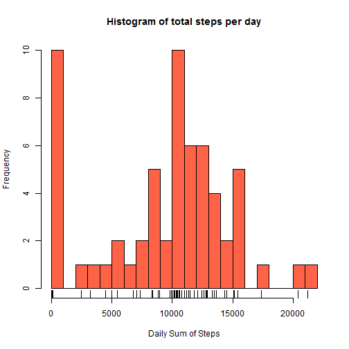
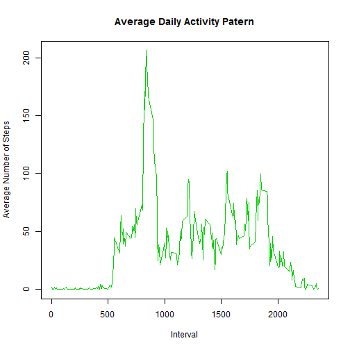
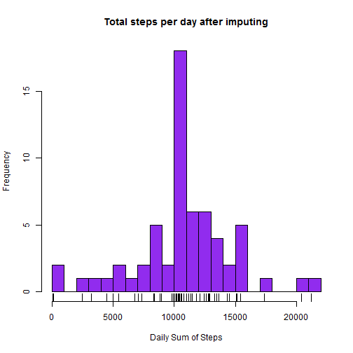
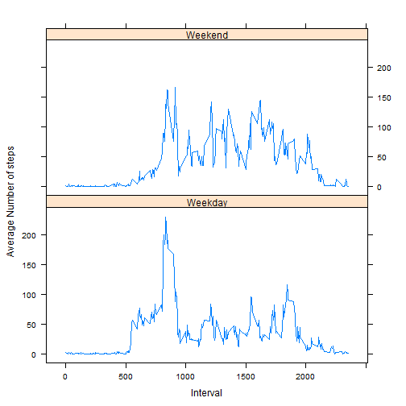

Reproducible Research / Peer Assessment 1
==========================================

Loading and preprocessing the data
-----------------------------------

We first load the data. We have a quick look at the data and use package `lubridate`
to transform the date column into an appropriate format.


```r
activity <- read.csv("./activity.csv", header=TRUE, 
                     na.strings="NA", stringsAsFactors = FALSE)

str(activity)
```

```
## 'data.frame':	17568 obs. of  3 variables:
##  $ steps   : int  NA NA NA NA NA NA NA NA NA NA ...
##  $ date    : chr  "2012-10-01" "2012-10-01" "2012-10-01" "2012-10-01" ...
##  $ interval: int  0 5 10 15 20 25 30 35 40 45 ...
```

```r
require(lubridate)
activity$date <- ymd(activity$date)
str(activity)
```

```
## 'data.frame':	17568 obs. of  3 variables:
##  $ steps   : int  NA NA NA NA NA NA NA NA NA NA ...
##  $ date    : POSIXct, format: "2012-10-01" "2012-10-01" ...
##  $ interval: int  0 5 10 15 20 25 30 35 40 45 ...
```

What is the mean total number of steps taken per day?
------------------------------------------------------

We will use the package `dplyr` in our analysis and we will, initially at least, ignore the 
missing values in our calculations. Let's start by calculating the total number of steps
taken each day:


```r
require(dplyr)
activity <- tbl_df(activity)

activity <- mutate(activity, yday=yday(date))
by_yday <- group_by(activity, yday)
daily_sums <- summarize(by_yday, sum(steps, na.rm=TRUE))
names(daily_sums) <- c("DayInYear", "SumOfSteps")
```

We then plot a histogram of the total number of steps taken each day:


```r
hist(daily_sums$SumOfSteps, col="tomato", breaks=20, 
     main = "Histogram of total steps per day", xlab = "Daily Sum of Steps")
rug(daily_sums$SumOfSteps)
```

 

Let's now calculate the mean and median of the total number of steps taken each day:


```r
mean(daily_sums$SumOfSteps)
```

```
## [1] 9354.23
```

```r
median(daily_sums$SumOfSteps)
```

```
## [1] 10395
```

What is the average daily activity pattern?
-------------------------------------------

In order to answer this question we group our data by 5 minute interval and plot them:


```r
by_interval <- group_by(activity, interval)
daily_average <- summarize(by_interval, mean(steps, na.rm=TRUE))
names(daily_average) <- c("interval","averagesteps")

with(daily_average, plot(interval, averagesteps, type="l", col="green3",
                         main="Average Daily Activity Patern", xlab="Interval",
                         ylab="Average Number of Steps"))
```

 

We then calculate the interval with the maximum average number of steps per day:


```r
maxindex <- which.max(daily_average$averagesteps)
daily_average[maxindex,1]
```

```
## Source: local data frame [1 x 1]
## 
##   interval
## 1      835
```

Imputing missing values
------------------------

Let's now see what's the impact of imputing the missing values in our dataset. We first calculate 
the total number of missing values in our dateset:


```r
sum(is.na(activity$steps))
```

```
## [1] 2304
```

We then create a new dataset replacing the missing values with the mean of each 5 minute 
interval over all days:


```r
activity_2 <- activity[!is.na(activity$steps),]
by_interval_2 <- group_by(activity_2, interval)
daily_average_2 <- summarize(by_interval_2, mean(steps))
names(daily_average_2) <- c("interval","meansteps")

newsteps <- vector()
for (i in 1:length(activity$steps)) {
  row <- activity[i, ]
  if (is.na(row$steps)) {
    newsteps[i] <- subset(daily_average_2, interval==row$interval)$meansteps
    } else {
      newsteps[i] <- row$steps
      }
  }

activity_noNAs <- activity
activity_noNAs$steps <- newsteps
```

We can now make a histogram of the total number of steps taken each day after imputing
the missing values:


```r
new_by_yday <- group_by(activity_noNAs, yday)
new_daily_sums <- summarize(new_by_yday, sum(steps))
names(new_daily_sums) <- c("DayInYear", "StepsSum")

hist(new_daily_sums$StepsSum, col="purple2", breaks=20,
     main="Total steps per day after imputing", xlab="Daily Sum of Steps")
rug(new_daily_sums$StepsSum)
```

 

We can now also calculate the mean and median number of steps taken each day:


```r
mean(new_daily_sums$StepsSum)
```

```
## [1] 10766.19
```

```r
median(new_daily_sums$StepsSum)
```

```
## [1] 10766.19
```

We can see that both mean and median have now increased. The median by a rather
modest 3% and the mean by a much more substantial 15%.

Are there differences in activity patterns between weekdays and weekends?
-------------------------------------------------------------------------

In order to answer this question we will use the data set with the filled-in missing values.


```r
wday_activity <- mutate(activity_noNAs, wday=wday(date))

WeekendWeekday <- vector()
for (i in 1:length(wday_activity$wday)) {
  if (wday_activity$wday[i] == 7) {
    WeekendWeekday[i] <- "Weekend"
    } else if (wday_activity$wday[i] == 1) {
      WeekendWeekday[i] <- "Weekend"
      } else {
        WeekendWeekday[i] <- "Weekday"
        }
  }

WeekendWeekday <- as.factor(WeekendWeekday)
wday_activity$wday <- WeekendWeekday

by_interval_3 <- group_by(wday_activity, wday, interval)
daily_average_3 <- summarize(by_interval_3, mean(steps))
names(daily_average_3) <- c("wday","interval","averagesteps")
```

Finally, we are using the package `lattice` to create a graph similar to the one
found on the Coursera GitHub:


```r
require(lattice)
xyplot(averagesteps ~ interval | wday, daily_average_3, type = "l", layout = c(1, 2), 
    xlab = "Interval", ylab = "Average Number of steps")
```

 
